# AWS GuardDuty Automated Threat Detection & Response Pipeline

**Full Detection Engineering Lifecycle — Built From Scratch**  
Oluwaseyi Michael Falode | Cybersecurity & Cloud Security Engineer | Toronto, ON | May 2026


---

A complete AWS-native automated threat detection and response pipeline built entirely from scratch — no pre-built stacks, no CloudFormation templates, no shortcuts. Every component was selected, configured, and wired together manually to demonstrate the full detection engineering lifecycle: from initial threat detection through automated remediation, audit logging, evidence storage, and real-time monitoring.

The end-to-end test generated 391 sample GuardDuty findings. The pipeline processed all qualifying findings automatically — routing through EventBridge, triggering Lambda for automated remediation, and delivering full JSON alert payloads to the analyst inbox within seconds. Zero manual intervention.

## Project at a Glance

| | |
|---|---|
| **Platform** | Amazon Web Services — Region: us-east-2 (Ohio) |
| **Services Used** | GuardDuty · EventBridge · SNS · Lambda · IAM · CloudTrail · S3 · CloudWatch |
| **Languages** | Python 3.12 (Lambda) · JSON (EventBridge rule pattern) |
| **Security Focus** | Threat detection · Automated remediation · Audit logging · Incident response |
| **Frameworks** | MITRE ATT&CK · Detection Engineering · SOAR · Least Privilege |
| **Test Result** | 391 findings generated · 8 SNS alerts delivered · Lambda invoked for HIGH severity |
| **Completed** | May 2026 |

## The Problem This Project Solves

Security teams face a fundamental detection engineering problem: **threats get logged, but nothing automatically happens.**

GuardDuty fires findings continuously — but a finding sitting in a dashboard does nothing to stop an attacker. In most environments, the gap between detection and response is measured in hours or days. By that time, a compromised EC2 instance has already been used for lateral movement, data exfiltration, or crypto mining.

Three gaps exist in the standard detection lifecycle:

- **Gap 1 — Alert fatigue:** GuardDuty generates findings across all severity levels. Without severity filtering, LOW-severity informational events flood the analyst queue and bury the critical signals. The response pipeline drowns in noise.
- **Gap 2 — Manual remediation:** Even when a HIGH severity finding is detected, a human must notice it, investigate it, and take action. In a real incident, this takes too long. A compromised EC2 instance needs to be isolated in seconds, not hours.
- **Gap 3 — No forensic chain:** Automated actions without logging are dangerous. If Lambda isolates an EC2 instance, every API call that action makes must be captured — by whom, from where, at what time — for compliance, legal hold, and post-incident investigation.

This pipeline addresses all three gaps simultaneously across eight AWS services wired in sequence.

## Pipeline Architecture

```
THREAT OCCURS IN AWS ACCOUNT
          |
          | GuardDuty monitors continuously
          v
 ┌─────────────────────────────────────────────────────────┐
 │  GUARDDUTY  (Detection Layer)                           │
 │  Monitors: CloudTrail · VPC Flow Logs · DNS · EKS · EC2│
 │  Generates structured findings with MITRE ATT&CK tags  │
 └──────────────────────┬──────────────────────────────────┘
                        │ Finding generated
                        v
 ┌─────────────────────────────────────────────────────────┐
 │  EVENTBRIDGE  (Routing & Severity Filter)               │
 │  Rule: guardduty-high-severity-response                 │
 │  Filter: severity >= 4 (MEDIUM + HIGH only)             │
 │  LOW severity (1-3) → dropped, no downstream action     │
 └────────────┬────────────────────────┬───────────────────┘
              │                        │
              │ simultaneously         │ simultaneously
              v                        v
 ┌────────────────────┐   ┌────────────────────────────────┐
 │  SNS               │   │  LAMBDA                        │
 │  (Alerting)        │   │  (Automated Remediation)       │
 │                    │   │                                │
 │  Topic:            │   │  Function:                     │
 │  guardduty-alerts  │   │  guardduty-auto-response       │
 │                    │   │  Runtime: Python 3.12          │
 │  Delivers full     │   │                                │
 │  JSON payload to   │   │  severity >= 7 (HIGH):         │
 │  analyst email     │   │  → Tag EC2 as COMPROMISED      │
 │  in seconds        │   │  → Isolate from rotation       │
 │                    │   │                                │
 └────────────────────┘   │  severity 4-6 (MEDIUM):        │
                          │  → Log to CloudWatch           │
                          │  → No destructive action       │
                          └────────────────────────────────┘
                                        │
                                        │ every API call logged
                                        v
 ┌─────────────────────────────────────────────────────────┐
 │  CLOUDTRAIL + S3  (Audit Trail & Evidence Storage)      │
 │  Trail: guardduty-audit-trail                           │
 │  Captures: every API call, who made it, from where      │
 │  Storage: S3 bucket (durable, tamper-evident)           │
 │  Log file validation: Enabled                           │
 └──────────────────────┬──────────────────────────────────┘
                        │ logs stream to CloudWatch
                        v
 ┌─────────────────────────────────────────────────────────┐
 │  CLOUDWATCH  (Monitoring Layer)                         │
 │  Dashboard: GuardDuty-Detection-Pipeline                │
 │  Metrics: IncomingBytes · IncomingLogEvents             │
 │  Confirms pipeline is alive and log data is flowing     │
 └─────────────────────────────────────────────────────────┘
```

**Detection flow:** `GuardDuty → EventBridge (severity filter) → SNS (alert) + Lambda (remediate) → CloudTrail + S3 (log) → CloudWatch (monitor)`

---

## Phase 1: GuardDuty — Detection Layer

GuardDuty was enabled in us-east-2 (Ohio). It serves as the primary detection engine — continuously analyzing multiple data sources for suspicious activity and generating structured findings with MITRE ATT&CK mappings.

**What GuardDuty Monitors:**
- CloudTrail logs — every API call made in the account
- VPC Flow Logs — all network traffic in and out of resources
- DNS logs — domain name queries from EC2 instances
- EKS audit logs — Kubernetes API calls and container behavior
- Runtime monitoring — process-level activity inside containers and EC2

**Severity Scale:**

| Severity | Range | Pipeline Action |
|---|---|---|
| LOW | 1–3 | Informational — logged only, no automated action triggered |
| MEDIUM | 4–6 | Notable — triggers full alert and response pipeline |
| HIGH | 7–10 | Critical — triggers immediate automated EC2 isolation |

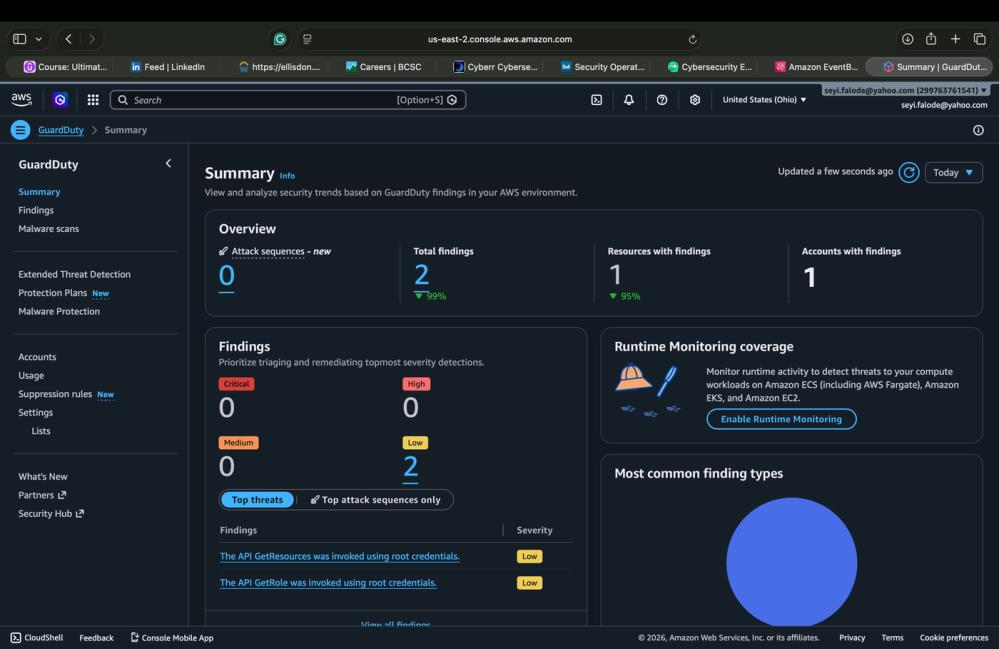

*Screenshot 1 — GuardDuty Summary Dashboard showing active findings and runtime monitoring coverage*

---

## Phase 2: EventBridge — Routing & Automation Layer

EventBridge is the central nervous system of the pipeline. It listens on the default event bus for GuardDuty findings and applies a severity filter before routing to downstream targets — preventing low-severity noise from flooding the response chain.

**Rule Configuration:**
- Rule name: `guardduty-high-severity-response`
- Event bus: default | Status: Enabled
- Severity filter: `{ "severity": [{ "numeric": [">=", 4] }] }` — only MEDIUM and HIGH findings trigger
- Target 1: `guardduty-alerts` (SNS) — email alert to analyst
- Target 2: `guardduty-auto-response` (Lambda) — automated remediation

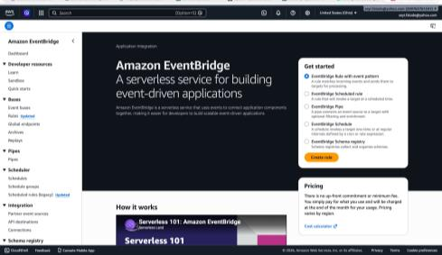

*Screenshot 2 — Amazon EventBridge homepage*

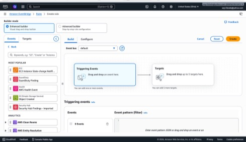

*Screenshot 3 — GuardDuty Finding selected as the triggering event source*

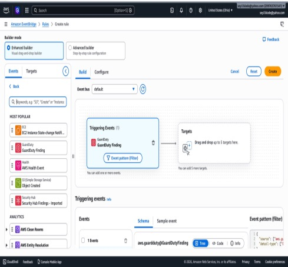

*Screenshot 4 — GuardDuty Finding dragged to the EventBridge rule canvas*

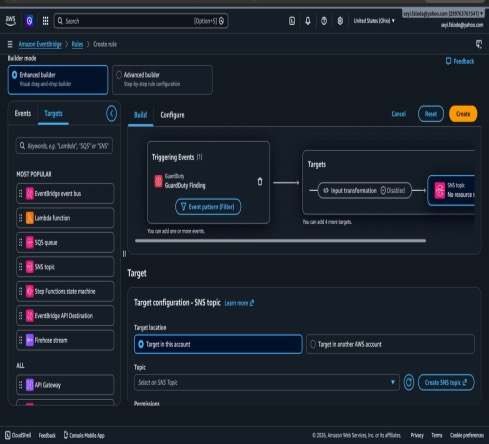

*Screenshot 5 — SNS target added (target invalid until topic created in Phase 3)*

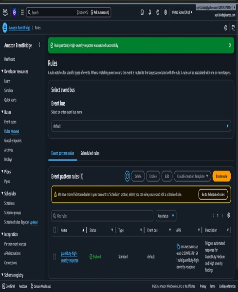

*Screenshot 6 — Rule guardduty-high-severity-response created and enabled*

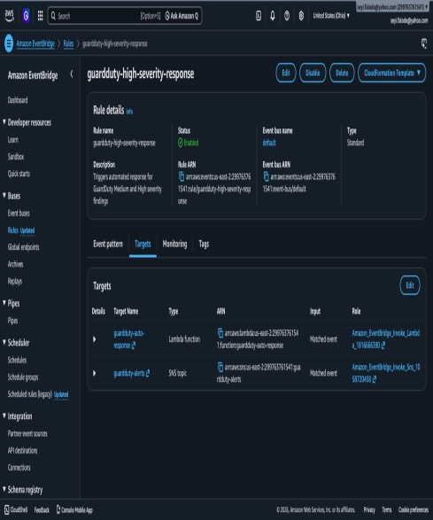

*Screenshot 7 — Both Lambda and SNS targets confirmed and active on the rule*

---

## Phase 3: SNS — Alerting Layer

Amazon SNS handles the human-facing side of the pipeline. When EventBridge routes a qualifying finding, SNS immediately delivers the full JSON finding payload as an email to the subscribed analyst address.

**Configuration:**
- Topic name: `guardduty-alerts` | Type: Standard | Region: us-east-2
- ARN: `arn:aws:sns:us-east-2:299763761541:guardduty-alerts`
- Subscription: Email → seyi.falode@yahoo.com | Status: Confirmed

> **Production note:** Confirmation email landed in Yahoo Junk — whitelist AWS notification emails (`no-reply@sns.amazonaws.com`) in any production deployment.

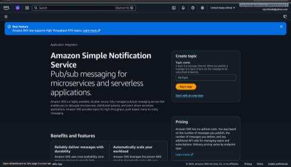

*Screenshot 8 — Amazon Simple Notification Service homepage*

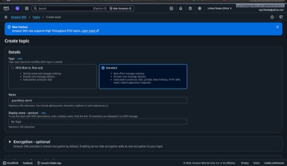

*Screenshot 9 — Creating the guardduty-alerts Standard topic*

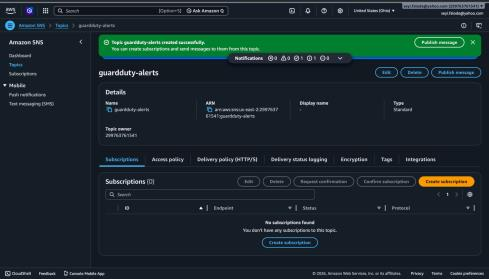

*Screenshot 10 — Topic created successfully with ARN confirmed*

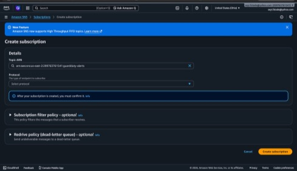

*Screenshot 11 — Creating email subscription to the guardduty-alerts topic*

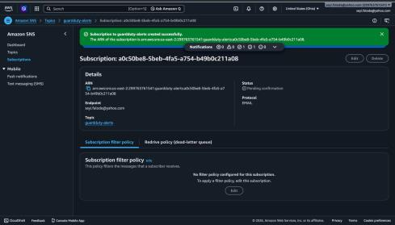

*Screenshot 12 — Subscription created, pending email confirmation*

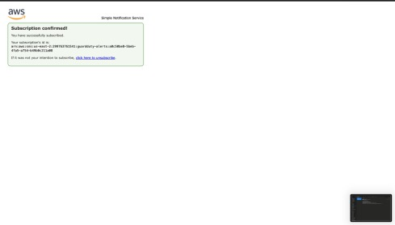

*Screenshot 13 — Subscription confirmed — analyst email is now active*

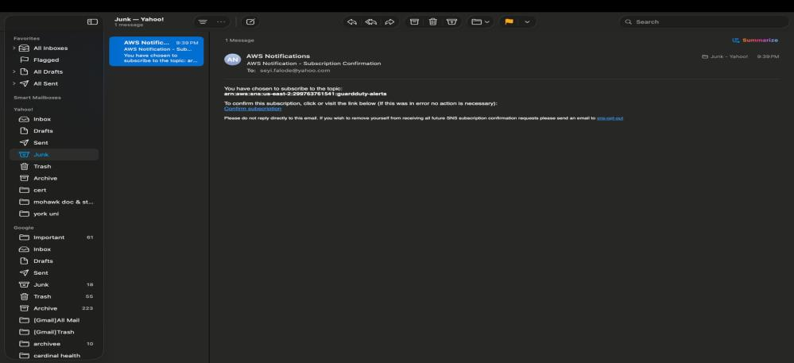

*Screenshot 14 — AWS confirmation email received in Yahoo (landed in Junk — expected behavior)*

---

## Phase 4: Lambda — Automated Remediation Layer

The Lambda function is the response engine. Written in Python 3.12, it receives GuardDuty findings from EventBridge, checks the severity, and either auto-remediates (HIGH) or logs and monitors (MEDIUM). No human needs to be watching a dashboard for HIGH severity threats to be acted on.

**Function Details:**
- Function name: `guardduty-auto-response` | Runtime: Python 3.12 | Region: us-east-2
- Severity >= 7 (HIGH): Tags compromised EC2 as `COMPROMISED` and initiates isolation
- Severity 4–6 (MEDIUM): Logs finding to CloudWatch, no destructive action — avoids false positive disruption
- Severity < 4 (LOW): Not triggered — filtered out upstream by EventBridge

**Key Code Logic:**

```python
def lambda_handler(event, context):
    detail = event.get('detail', {})
    severity = detail.get('severity', 0)
    resource_type = resource.get('resourceType', 'Unknown')

    # HIGH severity — auto-isolate immediately
    if severity >= 7:
        if resource_type == 'Instance':
            instance_id = resource.get('instanceDetails', {}).get('instanceId')
            isolate_ec2_instance(instance_id, region)  # tag as COMPROMISED + remove from rotation

    # MEDIUM severity — log only, no destructive action
    elif severity >= 4:
        logger.info(f"MEDIUM finding: {finding_type} — analyst review required")
```

```python
def isolate_ec2_instance(instance_id, region):
    ec2 = boto3.client('ec2', region_name=region)
    # Tag as COMPROMISED — preserves forensic state, does NOT terminate
    ec2.create_tags(
        Resources=[instance_id],
        Tags=[
            {'Key': 'SecurityStatus', 'Value': 'COMPROMISED'},
            {'Key': 'IsolatedBy',     'Value': 'guardduty-auto-response'},
            {'Key': 'IsolationReason','Value': 'GuardDuty HIGH severity finding'}
        ]
    )
```

> **Design decision:** The instance is tagged and isolated, **not terminated**. Terminating a compromised instance destroys forensic evidence. Isolation preserves the instance state for memory analysis, disk imaging, and post-incident investigation while removing it from production rotation.

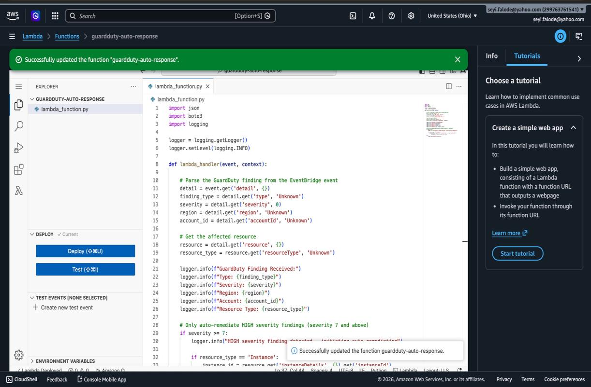

*Screenshot 15 — Lambda function guardduty-auto-response deployed and updated successfully*

---

## Phase 5: IAM — Least Privilege Permissions

The Lambda execution role was configured with four policies — the minimum required for the function to operate. Lambda only has access to exactly what it needs to do its job. Nothing more.

**Policies Attached:**

| Policy | Purpose |
|---|---|
| `AWSLambdaBasicExecutionRole` | Auto-created — base permission allowing Lambda to execute and write to CloudWatch Logs |
| `AmazonEC2FullAccess` | Allows Lambda to tag and modify EC2 instances during isolation |
| `AmazonGuardDutyReadOnlyAccess` | Allows Lambda to read finding details from GuardDuty |
| `CloudWatchLogsFullAccess` | Allows Lambda to write structured execution logs for every run |

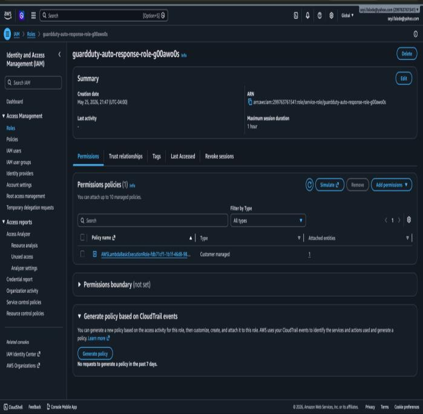

*Screenshot 16 — IAM role with only the base execution policy (before least privilege configuration)*

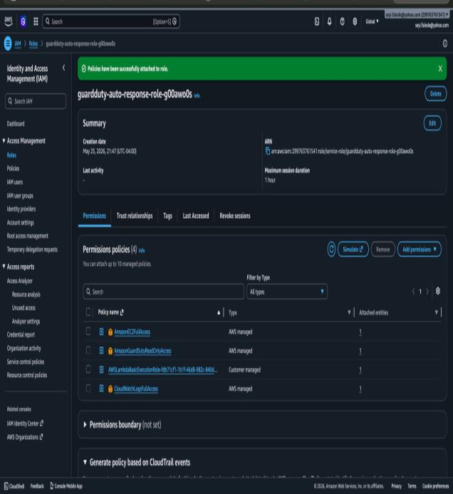

*Screenshot 17 — All four policies successfully attached — least privilege complete*

---

## Phase 6 & 7: CloudTrail + S3 — Audit Trail & Evidence Storage

CloudTrail captures every API call made in the account. When Lambda auto-remediates a finding — tagging an EC2 instance, modifying security groups — CloudTrail records the exact calls made, by which role, from which IP, at what time. This is the forensic evidence chain.

**Trail Configuration:**
- Trail name: `guardduty-audit-trail` | Region: us-east-2 | Multi-region: Yes
- S3 bucket: `guardduty-audit-logs-299763761541` — auto-provisioned during trail setup
- CloudWatch Logs integration: Enabled — real-time alerting on specific API patterns
- Log file validation: Enabled — detects tampering with stored log files
- Status: Logging

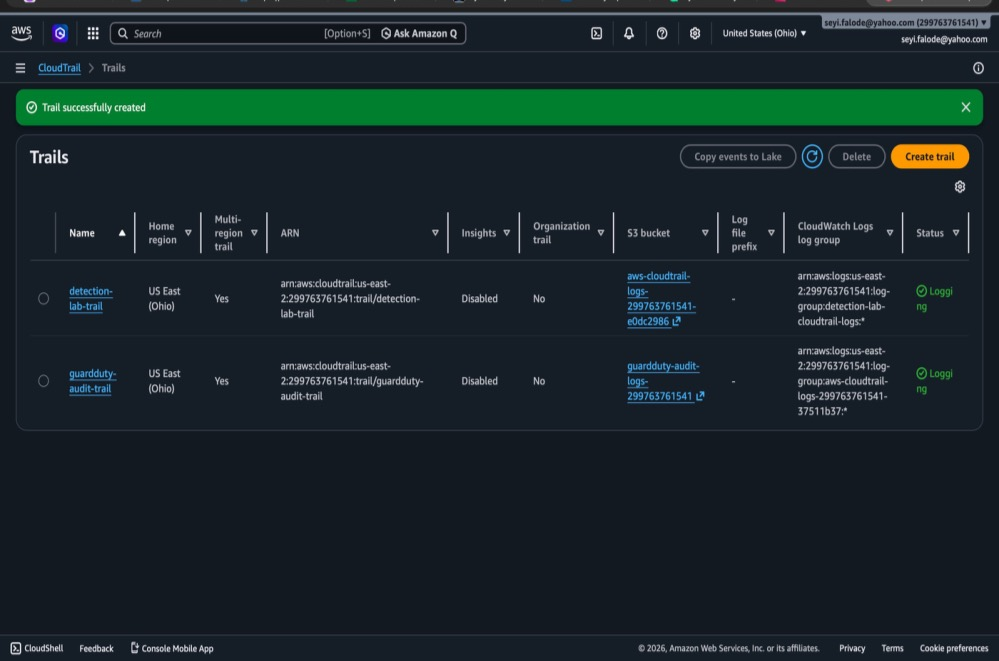

*Screenshot 18 — CloudTrail guardduty-audit-trail created and actively logging in us-east-2*

---

## Phase 8: CloudWatch — Monitoring Layer

A CloudWatch dashboard named `GuardDuty-Detection-Pipeline` provides real-time visibility into pipeline health. This is how you verify the pipeline is working, identify gaps in log delivery, and detect if any component stops functioning.

**Dashboard Metrics:**
- `IncomingBytes` — volume of log data flowing into the CloudTrail log group
- `IncomingLogEvents` — number of individual log events being ingested per minute
- Log groups monitored: `aws-cloudtrail-logs-299763761541-37511b37` and `detection-lab-cloudtrail-logs`

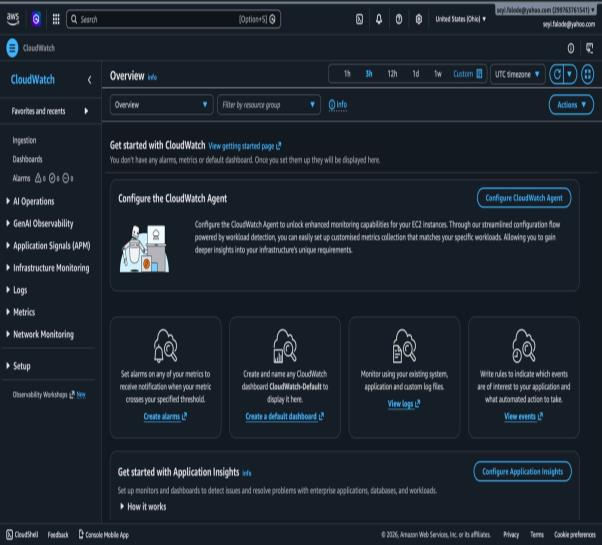

*Screenshot 19 — Amazon CloudWatch homepage*

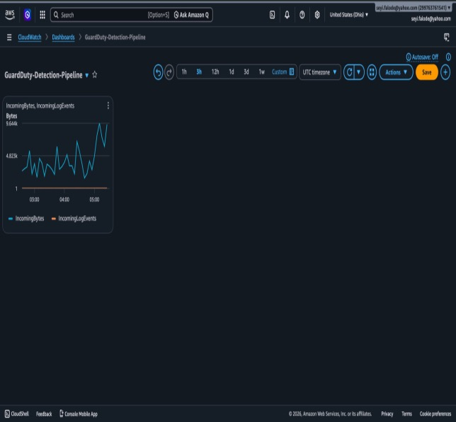

*Screenshot 20 — GuardDuty-Detection-Pipeline CloudWatch dashboard — pipeline health at a glance*

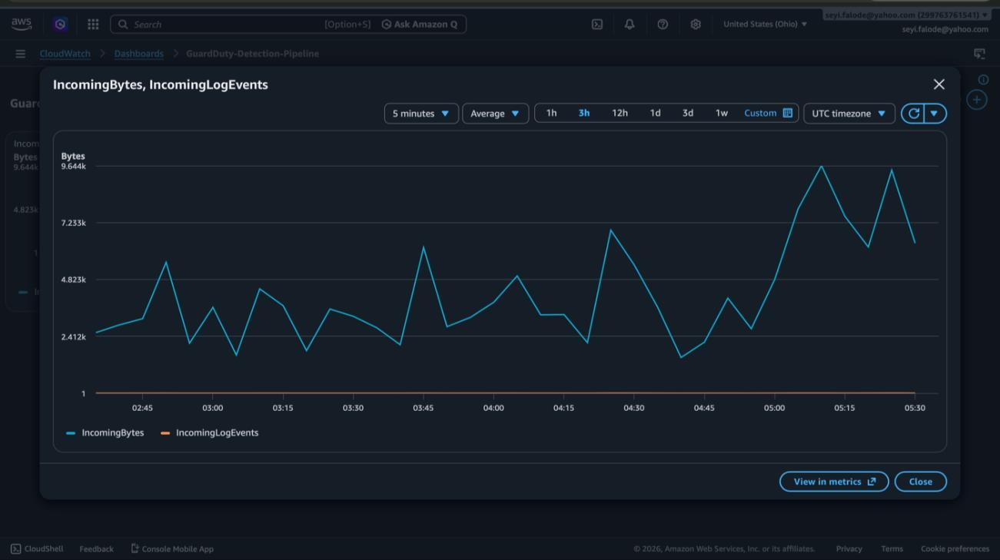

*Screenshot 21 — Live graph showing CloudTrail IncomingBytes and IncomingLogEvents activity in real time*

---

## End-to-End Pipeline Test

With all eight components wired together, the pipeline was tested by generating sample GuardDuty findings and observing the complete chain from detection to email delivery.

**Test Method:**
- Navigated to GuardDuty Settings → clicked **Generate sample findings**
- GuardDuty creates one sample finding for every supported finding type across all severities
- Observed findings flow through EventBridge → Lambda + SNS simultaneously

**Results:**

| Metric | Result |
|---|---|
| Total sample findings generated | 391 across all severity levels and finding types |
| EventBridge firing | Fired for all MEDIUM and HIGH findings (severity >= 4) |
| SNS alert emails received | 8 emails at seyi.falode@yahoo.com within seconds |
| Alert payload | Full JSON finding payloads including resource details, timestamps, MITRE mappings |
| Lambda invocation | Invoked for HIGH severity findings — execution logs confirmed in CloudWatch |

**Finding Types Observed in Alerts:**

| Finding Type | MITRE Tactic |
|---|---|
| `DefenseEvasion:Kubernetes/SuccessfulAnonymousAccess` | Defense Evasion |
| `DefenseEvasion:Runtime/FilelessExecution` | Defense Evasion |
| `PrivilegeEscalation:Runtime/ContainerMountsHostDirectory` | Privilege Escalation |
| `Trojan:Runtime/BlackholeDNSTraffic` | Command and Control |
| `Persistence:Runtime/SuspiciousCommand` | Persistence |
| `Execution:ECSCluster/MaliciousFile` (EICAR test file) | Execution |

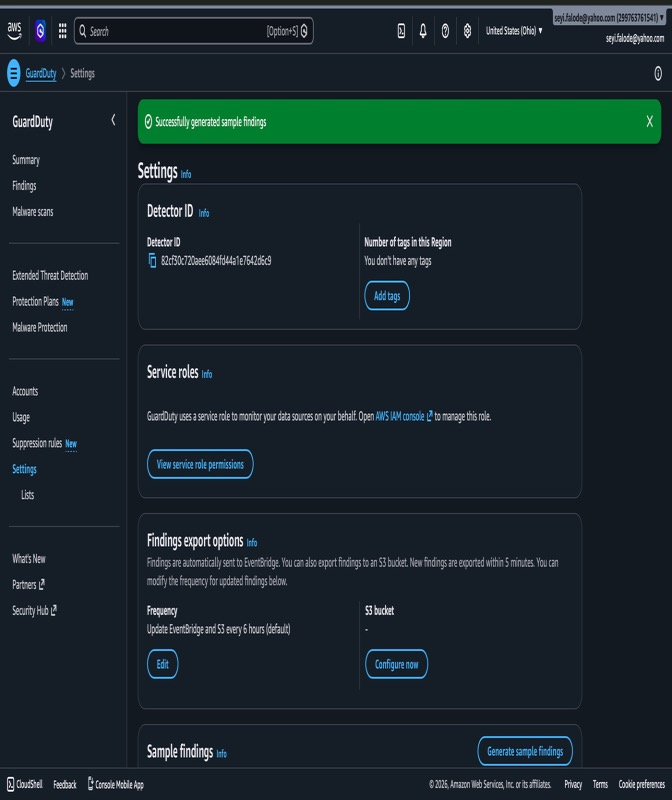

*Screenshot 22 — GuardDuty Settings — sample findings generated successfully*

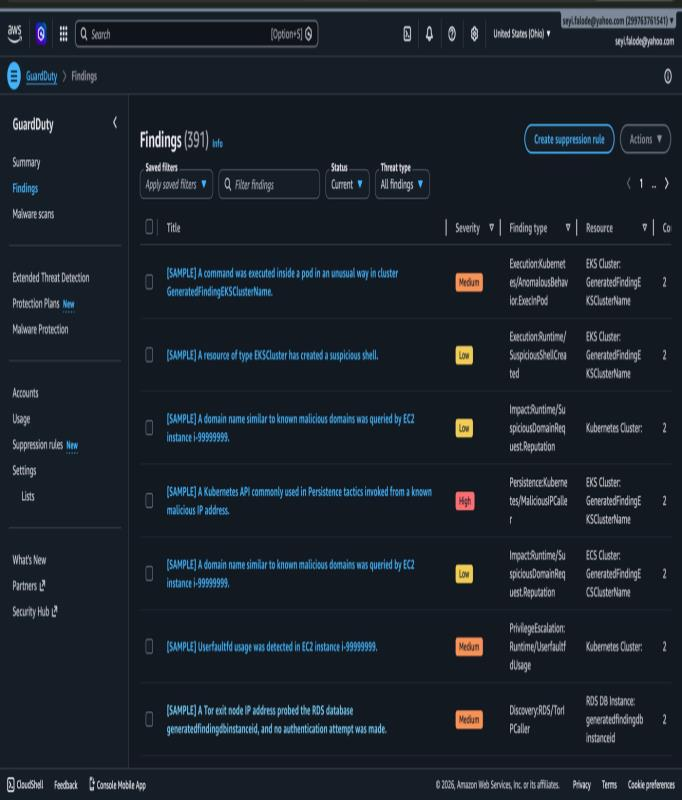

*Screenshot 23 — GuardDuty Findings dashboard showing 391 findings including HIGH and MEDIUM severity*

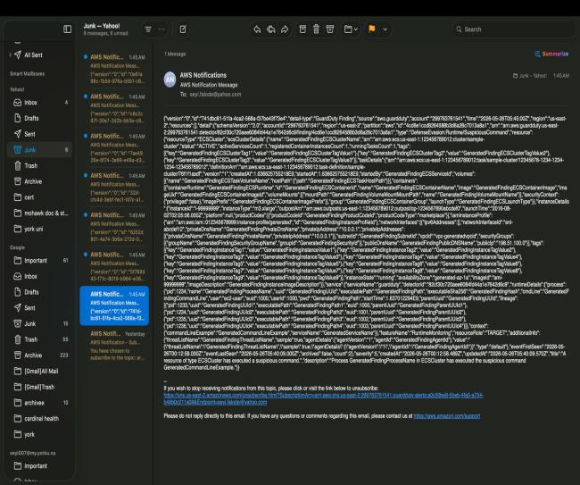

*Screenshot 24 — SNS alert email received — DefenseEvasion finding with full JSON payload*

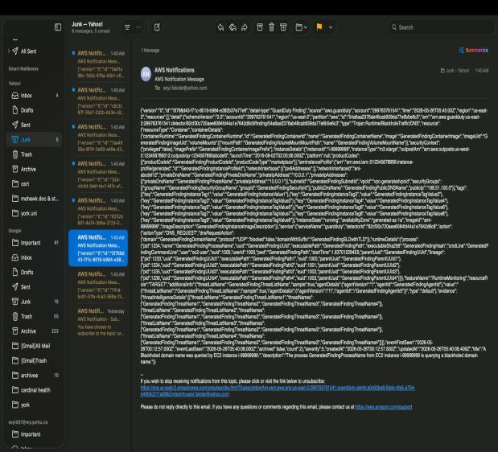

*Screenshot 25 — SNS alert email received — Malware scan / EICAR test file detection*

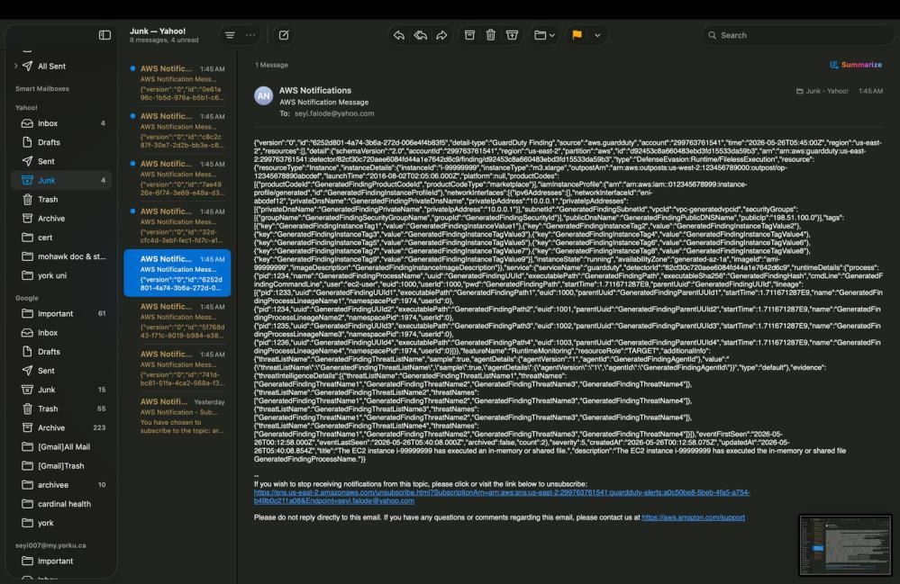

*Screenshot 26 — Multiple AWS Notifications in inbox confirming full pipeline is operational end-to-end*

---

## Repository Structure

```
aws-guardduty-threat-detection-pipeline/
├── lambda/
│   └── lambda_function.py          # Python 3.12 — auto-remediation function
├── eventbridge/
│   └── rule-pattern.json           # EventBridge rule — severity filter + dual targets
├── screenshots/                    # 26 screenshots from the live AWS session
│   ├── screenshot-01-guardduty-summary-dashboard.jpg
│   ├── screenshot-02-eventbridge-homepage.jpg
│   ├── ... (26 total)
│   └── screenshot-26-multiple-alerts-inbox-pipeline-confirmed.jpg
├── docs/
│   └── AWS_GuardDuty_Pipeline_v2.pdf   # Full lab report
└── README.md
```

## How to Reproduce This Pipeline

**Prerequisites:** AWS account with billing enabled, admin IAM user, AWS CLI configured

```bash
# 1. Enable GuardDuty
#    AWS Console → GuardDuty → Get Started → Enable GuardDuty
#    Region: us-east-2

# 2. Create SNS topic and email subscription
aws sns create-topic --name guardduty-alerts --region us-east-2
aws sns subscribe \
  --topic-arn arn:aws:sns:us-east-2:<ACCOUNT_ID>:guardduty-alerts \
  --protocol email \
  --notification-endpoint your@email.com \
  --region us-east-2
# Confirm subscription via email

# 3. Deploy Lambda function
#    AWS Console → Lambda → Create function
#    Name: guardduty-auto-response | Runtime: Python 3.12
#    Paste lambda/lambda_function.py into the inline editor
#    Deploy

# 4. Attach IAM policies to Lambda execution role
#    IAM → Roles → guardduty-auto-response-role → Add permissions:
#    - AmazonEC2FullAccess
#    - AmazonGuardDutyReadOnlyAccess
#    - CloudWatchLogsFullAccess

# 5. Create EventBridge rule
#    EventBridge → Rules → Create rule
#    Name: guardduty-high-severity-response
#    Event pattern: paste from eventbridge/rule-pattern.json
#    Targets: SNS topic (guardduty-alerts) + Lambda (guardduty-auto-response)

# 6. Create CloudTrail audit trail
aws cloudtrail create-trail \
  --name guardduty-audit-trail \
  --s3-bucket-name guardduty-audit-logs-<ACCOUNT_ID> \
  --is-multi-region-trail \
  --enable-log-file-validation \
  --region us-east-2
aws cloudtrail start-logging --name guardduty-audit-trail --region us-east-2

# 7. Build CloudWatch dashboard
#    CloudWatch → Dashboards → Create dashboard
#    Name: GuardDuty-Detection-Pipeline
#    Add widgets: IncomingBytes + IncomingLogEvents from CloudTrail log groups

# 8. Test the pipeline
#    GuardDuty → Settings → Generate sample findings
#    Watch: EventBridge fires → Lambda executes → SNS emails arrive
```

---

## Skills Demonstrated

**Detection Engineering**
- Designed complete threat detection lifecycle from scratch with no pre-built stacks
- Implemented severity-based triage logic to separate signal from noise and prevent alert fatigue
- Applied MITRE ATT&CK framework context to GuardDuty finding types
- Tuned automated response thresholds to prevent false positive disruption of workloads

**Cloud Security (AWS)**
- GuardDuty threat intelligence, finding triage, and sample findings generation
- EventBridge event-driven automation with JSON event pattern severity filtering
- Lambda serverless function development with boto3 SDK and Python 3.12
- SNS pub/sub alerting architecture with confirmed email subscription
- IAM least privilege role and policy configuration for cross-service access
- CloudTrail audit logging with CloudWatch Logs integration and log file validation
- S3 forensic evidence storage provisioned through CloudTrail trail setup

**Security Automation & SOAR**
- Automated EC2 isolation on HIGH severity findings with zero manual intervention
- End-to-end pipeline from detection to remediation executing in seconds
- Structured logging for every automated action via CloudWatch Logs

**Incident Response**
- Built complete forensic evidence chain: CloudTrail → S3 → CloudWatch
- Implemented tamper-evident log file validation on CloudTrail
- Isolation workflow preserves instance state for forensic analysis rather than terminating

---

*Oluwaseyi Michael Falode · Cybersecurity & Cloud Security Engineer · Toronto, ON · May 2026*  
*linkedin.com/in/oluwaseyi-falode · github.com/seyifalode-cmd*
